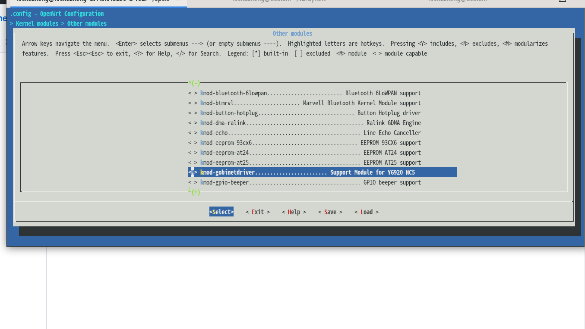

# Gobinet-package
it is Gobinet kernel package for openwrt, It can be compiled sucessfully at openwrt-21.0.1. you can try it on other version of openwrt
  1.please make directory named gobinetdriver in the directory of package in openwrt
  
  2.cp the source files provided by vendor to src folder
  
  3.run make menuconfig then select kernelmodules-> kmod-gobinetdriver
  
  4.run make package/gobinetdriver/compile V=s to generate gobinetdriver.ko 
  
there may be errors about atomic_read of qmidevice.c in some system, please modify &pDev->mQMIDev.mCdev.kobj.kref.refcount as &pDev->mQMIDev.mCdev.kobj.kref.refcount.refs
then the compile will be ok
if you have any question ,you can contact with xz_nie#hotmail.com
the module is CLM920_NC5 http://www.yuge-info.com/product/4g/PCIE-cat4/211.html

